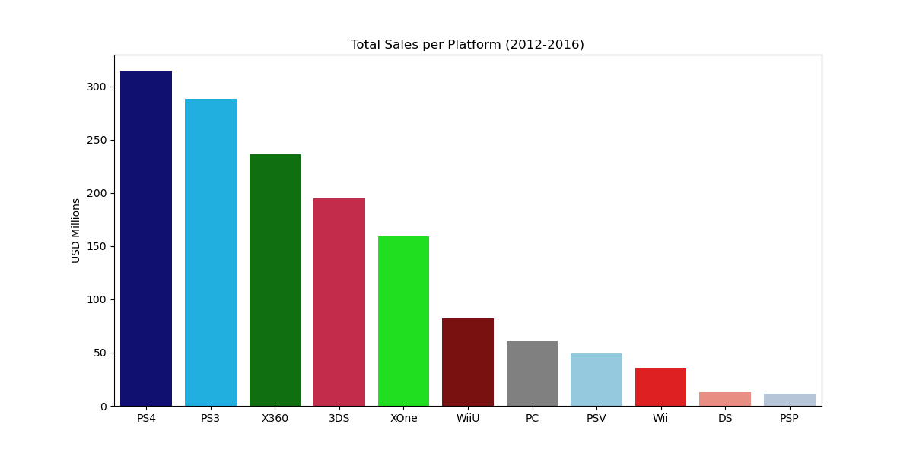
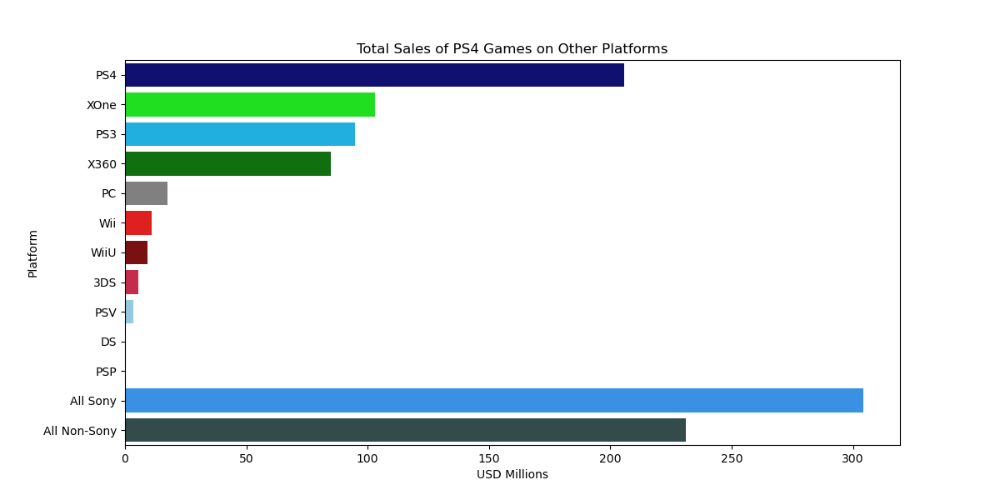
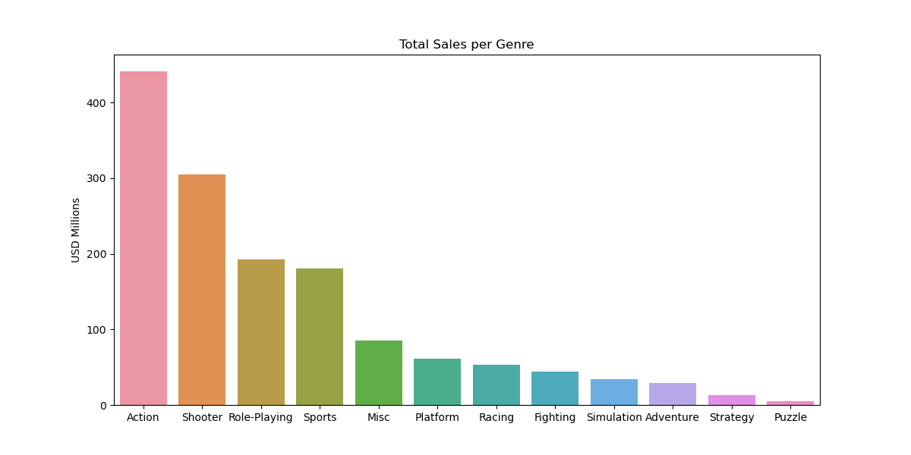

# Global Video Game Sales Analysis (1980 - 2016)

## Introduction

The following is an in-depth analysis of video game sales spanning from 1980 to 2016. This analysis includes detailed explorations of:

- Games released per year, charting the rise in popularity of the industry.
- Sales Variability platform to platform.
- The average life cycle of platforms to determine a ‘current period' for deeper analysis.
- Platform Sales data for the current period.
- Effect of critic and user scores on sales for the top performing platform of the current period.
- Comparing game sales on the top platforms to sales on other platforms.
- Sales by genre in the current period.
- Regional sales in the current period.
- Testing the hypothesis: “Average user ratings of the Xbox One and PC platforms are the same.”
- Testing the hypothesis: “Average user ratings for the Action and Sports genres are different.”

## Table of Contents

[Notebook](/EDA.ipynb)  
[Visualizations](images/)  
[Conclusions](#conclusions)  
[Libraries](#libraries)  

## Conclusions

This notebook has explored and provided insights into various facets of video game sales and trends, notably focusing on:

- **Data Cleaning Process**: Effective cleaning and resolving of data integrity issues. The paren_stings dictionary is used to categorized annotations added to the end of game titles, and the normalize_names function is used to clean the data set according to those categories.
- **Platform Lifecycle**: Determining an average lifecycle of approximately five years for gaming platforms.
- **Leading Platform Analysis**: Identification of PlayStation 4 as the dominant platform in terms of global sales.

- **Market Dominance**: Sony and PlayStation 4's continued leadership in the gaming industry.

- **Genre Profitability**: The Action and Shooter genres emerged as the most profitable, reflecting strong consumer preferences.

- **Regional Differences**: Notable differences in platform popularity, genre preferences, and the impact of ESRB ratings across regions.
- **Hypothesis Testing Conclusions**:
  - Hypothesis 1: Little statistical significance in user rating differences between Xbox One and PC.
  - Hypothesis 2: Significant differences in user scores between Action and Sports genres.

These insights provide a strategic guide for stakeholders in the video game industry for making informed decisions on future projects and marketing strategies.

## Libraries

pandas version 2.1.4  
numpy version 1.26.0  
matplotlib version 3.8.0  
seaborn version 0.12.2  
scipy version 1.11.3  
